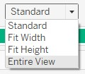

```{r setup, include=FALSE}
knitr::opts_chunk$set(echo = FALSE)
```

# 1.0 Overview
The data visualisation is published on [Tableau Public](https://public.tableau.com/views/DataVizMakeover1_16116436098390/LFPR2009-2019).

### 1.1 Clarity vs aesthetics

The original chart is presented below:

{width=100%}

In terms of aesthetics, the chart above looks acceptable. Font styles and colour schemes are easy on the eyes.

However, the presentation of the data itself could be clearer.

Based on this assessment, the chart falls into Quadrant IV of the matrix:

{width=100%}

# 2.0 Makeover
### 2.1 Critique of the visualisation, and suggested improvements
#### **2.1.1 Clarity**
S/n | Critique | Suggestions for improvement
- | ------ | ------
1 | _Unclear subtitle_. It is not clear what the subtitle "Per Cent" refers to. It almost looks to be put there as an afterthought. | _Remove the subtitle_ and label the appropriate axis with “%”. This will eliminate uncessary text, yet present the percentage values in a more intuitive manner.
2 | _The x-axis is not explained_. There are no labels to explain what the three types of values on the x-axis mean. | _Pivot the data_ such that the percentages are on the x-axis and the age group is on the y-axis, and label the axes accordingly. This will improve the clarity of the visualisation.
3 | _Age Group is not presented clearly_. Compounded with the blue and grey lines of the line graph, it looked as though a timeline was being presented. Only upon further examination was it understood to be a presentation of the proportion of age group in percentage. | _Pivot the data_ such that age group is presented on the y-axis. This will improve the intuitiveness of the visualisation.
4 | _Duplicate presentation of information_. The two lines of the line graph essentially present the same information as the percentage values in the x-axis. The line graph presents the trend visually, while the x-axis provides the actual percentage values. This duplication would not be needed with better visualization design. | _Remove the June 2009 and June 2019 percentage values from the x-axis_. This will no longer be necessary once the data is presented appropriately.

#### **2.1.2 Aesthetics**
S/n | Critique | Suggestions for improvement
- | ------ | ------
1 | _Good use of colour to differentiate the two time periods_. A more contrasting colour scheme might be better. | _Use more appealing colours_ to enhance the contrast and clarity of the two sets of data being compared.
2 | _Clear labeling_ of what the two lines in the line graph represent, and the median ages. However, better designed aesthetics could allow for more concise labeling (using less words). | _Include labels_ as necessary to improve conciseness and clarity.
3 | With thee different values, the _x-axis is too cluttered_. | This will be solved once the data is _pivoted appropriately_, as mentioned in section 2.1.1.
4 | A minor point: although best practice states that number ranges should start from 0, there is no need for the age group to start from 0 in this case, as this graph is meant to present the labour force which consists of only [persons aged 15 years and over](https://stats.mom.gov.sg/SL/Pages/Labour-Force-Introduction.aspx). The age groups presented covers the entire range of legal working age ranges. | No action necessary.

### 2.2 Sketch of the alternative visualisation

The sketch below is the proposed improved visualisation to address the critique presented in section 2.1.</br>

{width=100%}

### 2.3 Building the visualisation

This visualisation was built using [Tableau Desktop Professional Edition 2020.4.0](httpshttps://www.tableau.com/products/desktop).


**Step 1. Import data into Tableau**</br>Import Excel file into Tableau.</br>{width=100%}
</br></br>
**Step 2. The data is not standardised and cleaned because the formatting of the spreadsheet is not friendly for data importation.**</br>{width=100%}
</br></br>
**Step 3. Clean the data**</br>Click on the “Cleaned with Data Interpreter” to provide an initial clean-up of the data to allow for easier manual cleaning.</br>{width=100%}
</br></br>
**Step 4. Hide uneccessary columns**</br>Hide the left-most column as it is not useful for this analysis.</br>{width=75%}
</br></br>
**Step 5. Rename columns**</br>Rename the “Age (Years) 1” column to “Age Group” for clarity.</br>{width=30%}
</br></br>
**Step 6. Check data type Age column**</br>Check that the “Age” column is of the correct data type _(String)_.</br>{width=50%}
</br></br>
**Step 7. Check data type of year columns**</br>Check that the rest of the year columns are of the correct data type _(Number[decimal])_.</br>{width=100%}
</br></br>
**Step 8. Define Column and Row data**</br>Drag "2009" and "2019" to the Columns pane and "Age Group" to the Rows pane.</br>{width=100%}
</br></br>
**Step 9. Exclude irrelevant columns**</br>Exclude the "NULL" and "Total" columns from the chart as these are not useful for the analysis.
</br></br>
**Step 10. Exclude overlapping age group**</br>Exclude the overlapping age groups, as these will confuse the data presented in the visualisation.</br>{width=50%}
</br></br>
**Step 11. Sort Age Group**</br>Sort "Age Group" in descending order.
</br></br>
**Step 12. Superimpose the two charts**</br>Select "Dual Axis" to combine the two charts into one.</br>{width=50%}
</br></br>
**Step 13. Synchronise the two y-axes**</br>Select "Synchronise Axis" to ensure both charts' y-axes match.</br>{width=50%}
</br></br>
**Step 14. Remove header**</br>Remove "Show Header" to show only one y-axis.</br>{width=50%}
</br></br>
**Step 15. Change visualisation for 2019 chart**</br>Change the 2019 Mark to Bar chart.</br>{width=50%}
</br></br>
**Step 16. Reorder 2019 and 2009 charts**</br>Swap "SUM(2019)" to the front of the Columns pane to display the 2019 chart behind the 2009 chart.</br>{width=100%}
</br></br>
**Step 17. Show whole range of x-axis**</br>Edit the range of the x-axis to show the whole range of 0% to 100%. Rename label as "LFPR (%)".</br>{width=75%}
</br></br>
**Step 18. Expand chart view**</br>Change the view to "Entire View" for visual clarity.</br>{width=30%}
</br></br>
**Step 19. Edit chart title**</br>{width=100%}
</br></br>
**Step 20. Edit Legend title**</br>Edit the Legend title to "Year".</br>{width=50%}
</br></br>
**Step 21. Rename the Sheet**</br>{width=75%}
</br></br>
**Step 22. Completed visualisation**</br>The completed chart looks like this:</br>{width=100%}


### 2.4 Kkey observations from the visualisation
S/n | Observation
- | -------------
1 | The largest increase in LFPR from 2009 to 2019 was among the 50 to 64, and 65 to 69 age groups. This kind of shift in LFPR was to be expected of an [ageing population](https://stats.mom.gov.sg/Pages/Labour-Force-In-Singapore-2019.aspx) as more older workers joined the workforce than their younger counterparts.
2 | The 25 to 29 age group had the highest LFPR in 2009. Ten years later in 2019, the age group with the highest LFPR was 30 to 34, which was one age group younger than the original 25 to 29 age group. The showed that from 2009 to 2019, the age group with the highest LFPR moved down by one group. The reason for this trend is outside the scope of this analysis but is a potential area of interest for further study.
3 | Of all the age groups, only the 20 to 24 age group declined in LFPR from 2009 to 2019. This was the only exception among all the age groups. As this was typically the age group of university undergraduates, it may have signified that more people in this age group were attending university. However, this point warrants further study.
4 | Overall, the lower the age group, the slower the increase in LFPR from 2009 to 2019, with the exception of the 15 to 19 age group, which seemed to reverse the trend compared to the next older age group (20 to 24). This seemed to contradict Singapore’s Total Fertility Rate (TFR) which [has been declining consistently](https://www.singstat.gov.sg/modules/infographics/total-fertility-rate), but may have been bolstered by the slight up-tick in TFR in 2000.

Thanks for visiting my blog!

This post is a data visualisation assignment for the [MITB programme](https://scis.smu.edu.sg/master-it-business/about-mitb-main) at the Singapore Management University.
</br></br>
<font size="2"> Distill is a publication format for scientific and technical writing, native to the web.</br>
Learn more about using Distill at <https://rstudio.github.io/distill>. </font>
