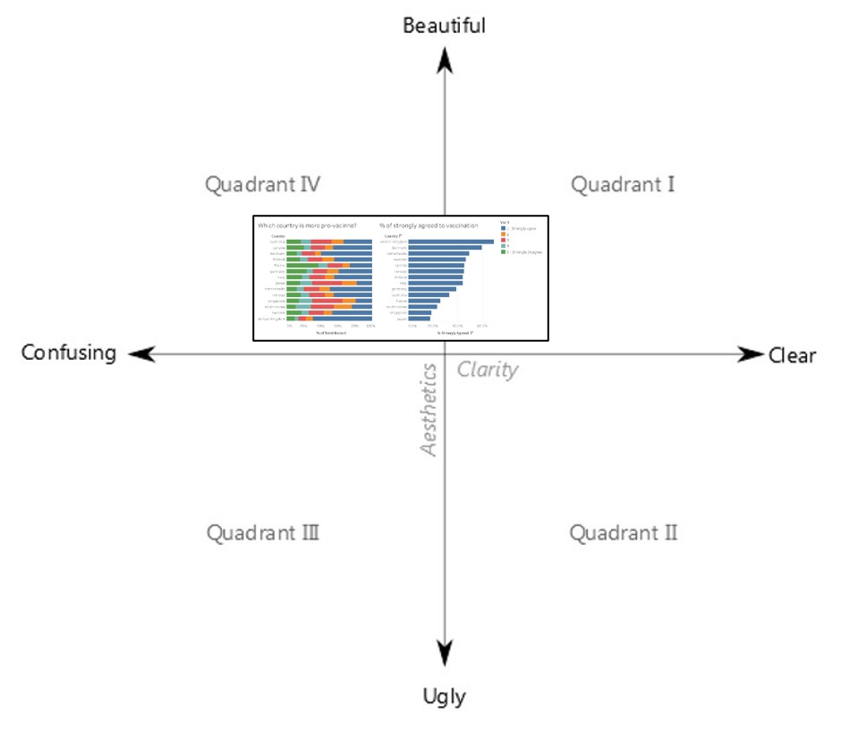
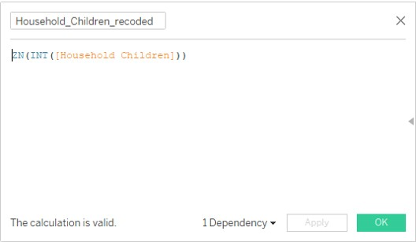
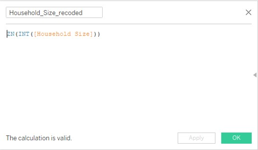
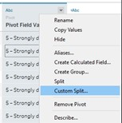
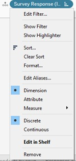
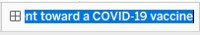
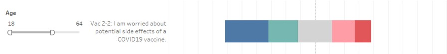

```{r setup, include=FALSE}
knitr::opts_chunk$set(echo = FALSE)
```

# 1.0 Introduction
One year on, the COVID-19 pandemic continues raging and is still very much on everyone’s mind. 2021 started with a faint glimmer of hope as vaccinations begin to roll out across the world. Countries that have access to the various vaccines are doing their best to fight against a current of anti-vaccine sentiment. While many people are hopeful that the vaccine will finally bring the pandemic under control, many others are wary of the potential dangers of being inoculated with a vaccine so new that any potential long-term side effects have yet to be uncovered. Compounding this fear is the fact that many of these vaccines were pushed through approval processes at lightning speed, causing people to question if the proper processes and due diligence were maintained.

[YouGov, together with Imperial College London](https://yougov.co.uk/topics/politics/articles-reports/2020/04/11/covid-19-how-yougov-partnership-imperial-college-), conducts an ongoing survey to gather data on people’s behaviours in response to COVID-19. This blog uses the publicly available data and focuses on people’s sentiments to the COVID-19 vaccines in particular, within January 2021.

## 1.1 The Scene
A research team is currently conducting a study to understand public sentiment regarding the COVID-19 vaccines. Below are two data visualisations created by one of the research scientists.{width=100%}

## 1.2 The Task
1.	Critique the graph for both its clarity and aesthetics. At least three observations from each evaluation criterion. (15 marks)
2.	With reference to the critique above, suggest an alternative graphical presentation to improve the current design. Sketch out the proposed design. The proposed alternative design should include interactive techniques. Support your design by describing the advantages or which part of the issue(s) your alternative design is trying to overcome. (15 marks)
3.	Using Tableau, design your proposed data visualisation. (25 marks)
4.	Provided step-by-step descriptions on how the data visualisation was prepared. (30 marks)
5.	Describe three major observations revealed by the data visualisation prepared. (15 marks)

The remade data visualisation can be viewed on [Tableau Public](https://public.tableau.com/profile/andywong#!/vizhome/DataVizMakeover2_16136143601240/SentimenttowardCOVID-19vaccine).

# 2.0 Makeover
## 2.1 Critique of the visualisation, and suggested improvements
### **2.1.1 Clarity**
S/n | Critique | Suggestions for improvement
- | ------ | ------
1 | _The graphs do not show the confidence intervals of the responses._ This does not provide a good sense of how reliable the survey score is. | _Include a confidence interval_ for a more accurate presentation of the survey results.
2 | _The visualisation is one-dimensional and too simplistic._</br></br>a) It does not take into account demographic data such as gender, age, employment status, and household constitution.</br></br>b) It only presents data from one single survey question. To have a fuller understanding of the people’s sentiment to the vaccine, other relevant questions should be included. | _Introduce more dimensions to the visualisation._</br></br>a) Include demographic profiling into the visualisation for a more nuanced presentation of the data.</br></br>b) Introduce other relevant survey questions for a deeper and fuller understanding of the data.
3 | _The stacked bar chart can more accurately reflect what the survey responses are._ While the stacked bars show the proportion of responses according to the survey score, it does not visually show the positive- or negative-leaning of the general sentiment. | _Redesign the stacked bar chart_ to show the general consensus of the responses in a more visually intuitive way.

### **2.1.2 Aesthetics**
S/n | Critique | Suggestions for improvement
- | ------ | ------
1 | _The colour scheme for the right-hand chart does not corroborate to the usual meaning of the colours._ Red typically has the opposite meaning of blue, and so if blue is 1, red should be 5 and not 3. | _Improve the colour scheme_ of the chart to be more intuitive.
2 | _The right-hand chart does not add much more value to the visualisation_ other than sorting the countries in descending order of responses to survey score 1. | _Redesign the right-hand chart entirely_ for better presentation of the data.
3 | _Lack of editing and proofreading of the title_. Spelling mistakes and grammatical errors, although not critical in themselves, distract from that which is critical: the main content and message of the visualisations. | _Ensure proper editing and proofreading of the content_ (eg. 'vaccine', not 'vacinne') to enhance the overall presentation and bring focus to the critical message of the visualisation. The names of the countries could also be shown to their proper format ('United Kingdom' instead of 'united-kingdom'), and capitalised.

Based on the above assessment, the chart falls across Quadrants I and IV of the matrix:
</br>
{width=100%}

## 2.2 Sketch an alternative visualisation
</br>
{width=100%}

## 2.3 Build the visualisation

### 2.3.1 Import the data
Step 1: Open Tableau. Add in any one of the data files as the data source.
{width=100%}

Step 2: Remove the table as the dataset.</br>
{width=60%}

Step 3: Double-click on “New Union”, multi-select all the country csv files and drag them into the Union dialogue under “Specific (manual).</br>
{width=75%}</br>
Click OK. This will union all the tables into one single dataset.

### 2.3.2 Clean the data
**Endtime column**</br>
Step 4: The “endtime” column will be used to ascertain the date of the survey response.</br>First, change the data type to string.</br>
{width=40%}

Step 5: Click on Custom Split.</br>
{width=40%}

Step 6: Type a space into “Use the separator” field to split by space.</br>Click OK.</br>
{width=50%}

Step 7: “endtime – Split 1” is created.</br>
{width=30%}

Step 8: Change data type to Date.</br>
{width=30%}

Step 9: Rename as “Endtime” for spelling consistency.</br>
{width=30%}

Step 10: Click on the column that is not needed and click Hide.</br>
{width=50%}

**Employment status merged column**</br>
Step 11: Click on Manage metadata.</br>
{width=70%}

Keep only the relevant columns:</br>_endtime Split-1_</br>_household_children_</br>_age_</br>_gender_</br>_household_size_</br>_employment_status_</br>_employment_status_1_</br>_employment_status_2_</br>_employment_status_3_</br>_employment_status_4_</br>_employment_status_5_</br>_employment_status_6_</br>_employment_status_7_</br>_Table Name_.

Some countries saved _employment_status_ data as Boolean type. This is mismatched from other countries that did not. As such, these columns needs to be merged into one single column to aid the building of the visualization.

Step 12: Create a calculated field as shown.</br>
{width=100%}

Step 13: Ensure data type is String.</br>
{width=30%}

Step 14: Rename the column.</br>
{width=50%}


**Household children recoded column**</br>
Step 15: Create a calculated field for household_children to remove null values.
{width=100%}

Step 16: Rename column.</br>
{width=40%}

Step 17: Ensure data type is integer.</br>
{width=40%}

**Household size recoded column**</br>
Step 18: Create a calculated field for household_size to remove null values.</br>
{width=100%}

Step 19: Ensure data type is integer.</br>
{width=40%}

Step 20: Rename column.</br>
{width=40%}

**Survey Question and Survey Response (INT) columns**</br>
Step 21: Pivot all survey responses to make the table long and narrow.</br>
{width=100%}

Step 22: Edit the aliases of all the survey questions for clarity.</br>
{width=50%}</br>
{width=100%}

Step 23: Ensure data type for Survey Question is String.</br>
{width=40%}

Step 24: Rename column.</br>
{width=30%}

Step 25: Split the Survey responses to retain only the number.</br>
{width=40%}</br>
{width=40%}

Step 26: Change the data type to integer.</br>
{width=30%}

**Country column**</br>
Step 27: Change the country names to the proper spelling.</br>
{width=40%}</br>
{width=100%}

Step 28: Ensure data type is String, and Geographic Role is Country/Region.</br>
{width=40%}

Step 29: Rename the field as “Country”.</br>
{width=30%}

**Age column**</br>
Step 30: Ensure data type is integer.</br>
{width=30%}

Step 31: Rename column for consistency.</br>
{width=30%}

**Gender column**</br>
Step 32: Ensure “gender” column is String type.</br>
{width=30%}

Step 33: Rename column for consistency.</br>
{width=30%}

**Saving a new data set**</br>
Step 34: Open a new Sheet and click View Data.</br>
{width=100%}

Step 35: Click on Export All and save data file as COVID_survey.csv. This will save only the cleaned fields and remove the hidden fields, thereby having a smaller dataset to use, for improved efficiency.</br>
{width=100%}

### 2.3.3 Creating the calculated fields
**Count Negative field**</br>
The Count Negative field orientates the centre of the neutral survey responses to 0, so that the Strongly Agree, Agree, Disagree, and Strongly Disagree can be presented in a visually more intuitive way.

Step 36: Create a calculated field named Count Negative.</br>
{width=100%}

**Gantt Start field**</br>
The Gantt Start field defines the starting point of the stacked bar chart.

Step 37: Create a calculated field named Gantt Start.</br>
{width=100%}

**Gantt Percent field**</br>
The Gantt Percent field defines the length of each portion of the stacked bar chart.

Step 38: Create a calculated field named Gantt Percent.</br>
{width=100%}

**Number of Records field**</br>
The Number of Records field counts the number of records in the dataset.

Step 39: Create a calculated field named Number of Records.</br>
{width=100%}

**Percentage field**</br>
The Percentage field converts the count of the entries to a percentage.

Step 40: Create a calculated field named Percentage.</br>
{width=100%}

**Strongly Agree and Agree Scores field**</br>
The Strongly Agree and Agree Scores field counts the number of Strongly Agree (1) and Agree (2) survey scores.

Step 41: Create a calculated field named Strongly Agree and Agree Scores.</br>
{width=100%}

**Total Count field**</br>
The Total Count field totals up the number of entries for each response.

Step 42: Create a calculated field named Total Count.</br>
{width=100%}

**Total Count Negative field**</br>
The Total Count Negative field totals up the numbers given in the Count Negative field.

Step 43: Create a calculated field named Total Count Negative.</br>
{width=100%}

**Proportion field**</br>
The Proportion field calculates the proportion of Strongly Agree and Agee Scores column against the total number of records.

Step 44: Create a calculated field named Proportion column.</br>
{width=100%}


**Prop_SE field**</br>
The Prop_SE field calculates the standard error of the Proportion field. This will be used to calculate the confidence interval of the survey responses.

Step 45: Create a calculated field named Prop_SE.</br>
{width=100%}

**Z_95% field**</br>
The Z_95% field calculates Z-score for the 95% confidence interval, to be used later.

Step 46: Create a calculated field named Z_95%.</br>
{width=100%}

**Prop_Margin of Error 95% field**</br>
The Prop_Margin of Error 95% field calculates standard error for a Z-score of 95%. This will be used later.

Step 47: Create a calculated field named Prop_Margin of Error 95%.</br>
{width=100%}

**Prop_Lower Limit 95% field**</br>
The Prop_Lower Limit 95% field calculates the lower limit of the standard error at a 95% confidence interval.

Step 48: Create a calculated field named Prop_Lower Limit 95%.</br>
{width=100%}

**Prop_Upper Limit 95% field**</br>
The Prop_Upper Limit 95% field calculates the upper limit of the standard error at a 95% confidence interval.

Step 49: Create a calculated field named Prop_Upper Limit 95%.</br>
{width=100%}

### 2.3.3 Create the worksheet (Comparison within country)
Step 50: Drag Endtime to the Filters Pane and filter to January 2021, since the scope of this visualisation is only for that month.

Step 51: Right-click on Endtime and select January 2021. Click OK.</br>
{width=50%}

Step 52: Drag Gantt Percent to the Columns Pane and Survey Questions to the Rows Pane.</br>
{width=40%}

Step 53: On Gantt Percent, click on the small arrow and ensure Continuous format, and Compute Using, Survey Response (INT).</br>
{width=40%}

Step 54: On Survey Question, click on the small arrow and ensure Continuous format, Compute Using Survey Response (INT).</br>
{width=30%}

Step 55: Drag Survey Response (INT) to the Colour Mark, and set to Dimension and Discrete.</br>
{width=30%}

Step 56: Drag Percentage to the Size mark and set to Continuous.</br>
{width=40%}

Step 57: Drag Survey Response (INT) to the Detail Mark and set to Dimension and Discrete.</br>
{width=30%}

Step 58: Click on the Colour Mark, click on Edit Colours and customise the colour scheme of Survey Response (INT) accordingly.</br>
{width=50%}

Step 59: Adjust the size of Percentage accordingly to make the bars in the chart of the appropriate thickness.</br>
{width=30%}

Step 60: Drag Country to Filters Pane and select Show Filter.</br>
{width=30%}

Step 61: Click on the small arrow beside Country and select Single Value (dropdown).</br>
{width=30%}

Step 62: Drag the Filter to the top of the graph.</br>
{width=100%}

Step 63: Drag gender to Filters Pane and select Show Filter.</br>
{width=30%}

Step 64: Click on the small arrow beside gender and select Single Value (dropdown).</br>
{width=30%}

Step 65: Click on the small arrow beside gender and select Edit Title. Type “Gender”.</br>
{width=100%}

Step 66: Drag age to Filters Pane and select Show Filter.</br>
{width=30%}

Step 67: Click on the small arrow beside age and select Range of Values.</br>
{width=30%}

Step 68: Click on the small arrow beside age and select Edit Title. Type “Age”.</br>
{width=100%}

Step 69: Drag Employment status merged to Filters Pane and select Show Filter.</br>
{width=30%}

Step 70: Click on the small arrow beside Employment status merged and select Single Value (dropdown).</br>
{width=30%}

Step 71: Click on the small arrow beside Employment status merged and select Edit Title. Type “Employment Status”.</br>
{width=100%}

Step 72: Drag Household Children recoded to Filters Pane and select Show Filter.</br>
{width=30%}

Step 73: Click on the small arrow beside Household Children recoded and select Range of Values.</br>
{width=30%}

Step 74: Click on the small arrow beside Household Children recoded and select Edit Title. Type “No. of Children in Household”.</br>
{width=100%}

Step 75: Drag Household Size recoded to Filters Pane and select Show Filter.</br>
{width=30%}

Step 76: Click on the small arrow beside Household Size recoded and select Range of Values.</br>
{width=30%}

Step 77: Click on the small arrow beside Household Size recoded and select Edit Title. Type “Size of Household”.</br>
{width=100%}

Step 78: Double click on the title and edit accordingly to show the customized settings selected by the user.</br>
{width=75%}

Step 79: Double-click on the worksheet tab and rename accordingly.</br>
{width=40%}

Step 80: Click on the y-axis label Survey Question and sort in descending order.</br>
{width=30%}

Step 81: The final chart is shown below.</br>
{width=100%}

### 2.3.4 Create the worksheet (Comparison across countries)
Step 82: Drag Endtime to the Filters Pane and filter to January 2021, since the scope of this visualisation is only for that month.

Step 83: Right-click on Endtime and select January 2021. Click OK.</br>
{width=50%}

Step 84: Drag Measure Values to the Columns Pane and Country to the Rows Pane.</br>
{width=40%}

Step 85: Drag Gender to the y-axis and to the Colour Mark.</br>
{width=30%}

Step 86: Click on Colour then Edit Colours, and edit the colours accordingly.</br>
{width=50%}

Step 87: Drag Proportion to the top of the chart.</br>
{width=100%}

Step 88: Right-click and select Synchronise Axis.</br>
{width=30%}

Step 89: Drag Measure Names to the Filters Pane, click on the small arrow and select Edit Filter.</br>
{width=30%}

Step 90: Select the Prop_Lower Limit 95% and Prop_Upper Limit 95% to define the upper and lower limits of the 95% confidence interval.</br>
{width=50%}

Step 91: Drag Survey Question to the Filters Pane. Click on the small arrow and select Show Filter.</br>
{width=30%}

Step 92: Drag the Filter to the top of the graph.</br>
{width=100%}

Step 93: Drag both Prop_Lower Limit 95% and Prop_Upper Limit 95% to the Measure Values Pane.</br>
{width=40%}

Step 94: Ensure Measure Names is in the Measure Values Marks.</br>
{width=30%}

Step 95: Select Line as the Mark Type.</br>
{width=30%}

Step 96: Ensure Measure Names is also in AGG(Proportion) Pane. Change Mark Type to Colour and Circle.</br>
{width=30%}

Step 97: Edit the colour of the Proportion measure.</br>
{width=50%}

Step 98: Edit the colour of the Measure Values.</br>
{width=30%}

Step 99: Drag gender to Filters Pane and select Show Filter.</br>
{width=30%}

Step 100: Click on the small arrow beside gender and select Single Value (dropdown).</br>
{width=30%}

Step 101: Click on the small arrow beside gender and select Edit Title. Type “Gender”.</br>
{width=100%}

Step 102: Drag age to Filters Pane and select Show Filter.</br>
{width=30%}

Step 103: Click on the small arrow beside age and select Range of Values.</br>
{width=30%}

Step 104: Click on the small arrow beside age and select Edit Title. Type “Age”.</br>
{width=100%}

Step 105: Drag Employment status merged to Filters Pane and select Show Filter.</br>
{width=30%}

Step 106: Click on the small arrow beside Employment status merged and select Single Value (dropdown).</br>
{width=30%}

Step 107: Click on the small arrow beside Employment status merged and select Edit Title. Type “Employment Status”.</br>
{width=100%}

Step 108: Drag Household Children recoded to Filters Pane and select Show Filter.</br>
{width=30%}

Step 109: Click on the small arrow beside Household Children recoded and select Range of Values.</br>
{width=30%}

Step 110: Click on the small arrow beside Household Children recoded and select Edit Title. Type “No. of Children in Household”.</br>
{width=100%}

Step 111: Drag Household Size recoded to Filters Pane and select Show Filter.</br>
{width=30%}

Step 112: Click on the small arrow beside Household Size recoded and select Range of Values.</br>
{width=30%}

Step 113: Click on the small arrow beside Household Size recoded and select Edit Title. Type “Size of Household”.</br>
{width=100%}

Step 114: Sort Proportion of responses in descending order.</br>
{width=50%}

Step 115: Double click on the title and edit accordingly to show the customized settings selected by the user.</br>
{width=50%}

Step 116: Double-click on the worksheet tab and rename accordingly.</br>
{width=40%}

Step 117: The final graph is shown below.</br>
{width=100%}

### 2.3.5 Create the dashboard
Step 118: Drag “Comparison within country” and “Comparison across countries” into the left-hand and right-hand pane in the dashboard.</br>
{width=100%}

Step 119: Rearrange the filters accordingly.</br>
{width=20%}

Step 120: Change filter settings to “All Values in Database” so that filter options affect the whole dashboard.</br>
{width=50%}

Step 121: Edit dashboard title.</br>
{width=50%}

Step 122: Rename dashboard.</br>
{width=40%}

Step 123: The final dashboard is shown below.</br>
{width=100%}

# 3.0 Insights from the new visualisation

### Observation 1: People are generally open to being vaccinated against COVID-19.
This pertains to survey questions _Vac 1_, _Vac 2-3_, _Vac 2-6_, and _Vac 3_.

Overall, there is an openness to being vaccinated against COVID-19 across all countries. This can be seen from the longer bars for Strongly Agree (blue bar) and Agree (teal bar) vis-a-vis Strongly Disagree (red bar) and Disagree (pink bar), indicating a higher proportion of responses to Strongly Agree and Agree. See sample below.</br></br>{width=75%}

### Observation 2: Females are generally more concerned about contracting COVID-19 than males.
This pertains to survey question _Vac 2-1_. All countries except Singapore show that, at a confidence interval of 95%, the female population (orange line) are more concerned about contracting the coronavirus compared to males (blue line).</br>{width=75%}

### Observation 3: Older people are generally less concerned about the side-effects of a vaccine.
This pertains to survey question _Vac 2-2_. Across all countries, respondents aged 65 to 99 years indicate that they are less concerned about the side-effects of a vaccine...</br>{width=75%}</br>...compared to younger people (18 to 64 years old).</br>{width=75%}

From the visualisation, we can see that this age group of respondents has longer 95% confidence interval lines, compared to across all age groups. This could be because there are comparatively less respondents from this age group. Females in this age category tend to be more concerned about side effects than males. </br>{width=75%}</br>

# Appendix

The survey questions used in this visualisation are as follows.

Code | Question
-- | -------------
Vac 1 | If a Covid-19 vaccine were made available to me this week, I would definitely get it.
Vac 2-1 | I am worried about getting COVID-19.
Vac 2-2 | I am worried about potential side effects of a COVID-19 vaccine.
Vac 2-3 | I believe government health authorities in my country will provide me with an effective COVID-19 vaccine.
Vac 2-6 | If I do not get a COVID-19 vaccine when it is available, I will regret it.
Vac 3 | If a COVID-19 vaccine becomes available to me a year from now, I definitely intend to get it.

Thanks for visiting my blog!

This post is a data visualisation assignment for the [MITB programme](https://scis.smu.edu.sg/master-it-business/about-mitb-main) at the Singapore Management University.
</br></br>
<font size="2"> Distill is a publication format for scientific and technical writing, native to the web.</br>
Learn more about using Distill at <https://rstudio.github.io/distill>. </font>