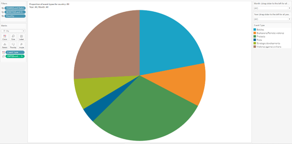

```{r setup, include=FALSE}
knitr::opts_chunk$set(echo = FALSE)
```

# 1.0 Introduction
On 1 February 2021, the world woke up to news of a coup in Myanmar. Innocent lives were ended and economic activity virtually brought to a standstill. The reality of political violence, societal harm and economic damage that armed conflict leaves in its wake was once again brought to the forefront of our collective minds.

In light of these developments, this dashboard visualises armed conflict in Southeast Asia from 2010 to 2020, with the objective of surfacing the most common and deadliest types of conflict.

This visualisation makes use of data provided by [The Armed Conflict Location & Event Data Project (ACLED)](https://acleddata.com/#/dashboard). {width=0%}

## 1.1 The Scene
This is a visualisation created to reveal the saptio-temporal patterns of armed conflict in selected Southeast Asian countries between 2015 to 2020. {width=100%}

## 1.2 The Task
1.	Critique the visualisation above for its clarity, aesthetics and interactivity. At least two observations from each evaluation criterion.
2.	With reference to the critique above, suggest an alternative data visualisation and interactive techniques to improve the current design. Support your design by describing the advantages or which part(s) of the issue(s) your alternatives design attempts to overcome.
3.	Using Tableau, design your proposed data visualisation.
4.	Provided step-by-step descriptions on how the data visualisation was prepared.
5.	Describe five major observations revealed by the data visualisation prepared.

The remade data visualisation was created using [Tableau Desktop 2020.4.2](https://www.tableau.com/products/desktop) and can be viewed on [Tableau Public](https://public.tableau.com/profile/andywong#!/vizhome/DataVizMakeover3ArmedconflictinSoutheastAsia/GeolocationofarmedconflictinSoutheastAsia).

# 2.0 Makeover
## 2.1 Critique of the visualisation, and suggested improvements
### 2.1.1 Clarity
S/n | Critique | Suggestions for improvement
- | ------ | ------
2 | The visualisation is clear in presenting the event types (types of conflict). It also allows the user to select which country to focus on. However, this is very limited information and _does not show any other information that might be useful in such analysis._ | _Allow the user to drill down into deeper information_ such as event sub types and number of fatalities specific to each region within a country.
1 | The 6 line graphs _do not have uniform ranges in the y-axis._ This makes it confusing for the user and difficult to compare between different event types.| Redesign the line graphs such that the _y-axis ranges are uniform_.

### 2.1.2 Aesthetics
S/n | Critique | Suggestions for improvement
- | ------ | ------
1 | _The dots in the map do not provide any further information other than the location of the event._ | Allow the _size of the dots to represent the number of fatalities._
2 | _The labels in the line graph are superfluous._ If removed, the size of the graph can be increased for better ease of viewing. | _Remove the labels in the line graph_ and use colours to represent instead.

### 2.1.3 Interactivity
S/n | Critique | Suggestions for improvement
- | ------ | ------
1 | The visualisation _does not allow selection of specific months or years for deeper analysis._ This limits the usability of the visualisation. | _Include an interactive feature that allows the user to select a specific month and year to focus in to._
2 | The visualisation _does not allow the user to select more than one country at a time._ Such features might be useful to the user for comparison and analysis. | Include a feature to _allow the user to select more than one country at a time._


## 2.2 Sketch of proposed alternative visualisation
</br>
{width=100%}

The proposed visualisation above provides more in-depth analysis such as the proportion of each event type and sub type, as well as a comparison of the number of fatalities of each event type.

The visualisation allows the user to select the specific month and year for deeper analysis.

the visualisation allows the user to select more than one country for presentation, for more useful analysis. The tree map of sub event types also allows for this same feature of selecting multiple sub event types for analysis, instead of only a single type each time.

The visualisation makes use of colour to replace labels, allowing for more intuitive associations, as well as to free up more space to allow the charts to be larger.

## 2.3 Build the visualisation

### 2.3.1 Importing the data
**Step 1**: Connect to the data set.
{width=100%}

Ensure data types are correct.</br>
**Step 2**: Change _Region_ to _Country/Region_ type.</br>
{width=60%}

**Step 3**: Change _Admin1_ to _State/Province_ type.</br>
{width=60%}

**Step 4**: Change _Admin2_ to _County_ type.</br>
{width=60%}

**Step 5**: Change _Admin3_ to _City_ type.</br>
{width=60%}

**Step 6**: Create a calculated field _Inter1(recoded)_.</br>
{width=60%}

**Step 7**: Enter the following formula to show the specific terminology instead of the code.</br>
{width=100%}

**Step 8**: Create a calculated field _Inter2(recoded)_.</br>
{width=60%}

**Step 9**: Enter the formula below.</br>
{width=100%}

**Step 10**: Create a calculated field _Interaction(recoded)_.</br>
{width=60%}

**Step 11**: Enter the formula shown to show the exact interaction instead of only the interaction code.</br>
{width=100%}

### 2.3.2 Creating the geospatial map representation

**Step 12**: Open a new Sheet. Drag _Country_, _Admin1_, _Admin2_, _Admin3_ onto _Region_ to create a hierarchical group of geographical data.</br>
{width=40%}

**Step 13**: Drag _Country_ to the middle of the work pane and select _symbol maps_ from the _Show Me_ menu.</br>
{width=100%}

**Step 14**: In the _Marks_ pane, click on the _“+”_ sign in front of _Country_ to expand it until _Admin3_ is shown.</br>
{width=100%}

**Step 15**: Remove _Admin1_ and _Admin2_.</br>
{width=100%}

**Step 16**: Drag _Event Type_ on to the _Color_ Mark in the _Mark_ pane.</br>
{width=100%}

**Step 17**: Edit the transparency and border settings for better visual clarity.</br>
{width=100%}

**Step 18**: Drag _Fatalities_ on to the _Size_ Mark in the _Mark_ pane. Ensure it is measured by _SUM_ to show the total number of fatalities.</br>
{width=100%}

**Step 19**: Adjust the size of the circles for better clarity.</br>
{width=100%}

**Step 20**: Drag the _Country_ field to the _Filters_ pane. When the settings dialogue pops up, select _Use all_.</br>
{width=60%}

**Step 21**: Right-click on _Country_ and select _Show Filter_.</br>
{width=100%}

**Step 22**: Click on the drop-down arrow on the _Country_ filter and select _Single Value (dropdown)_.</br>
{width=100%}

**Step 23**: Do the same for the _Event Type_ field.</br>
{width=100%}

**Step 24**: Drag _Event Date_ to the _Pages_ pane twice. The first time will automatically set to YEAR; the second time will automatically set to QUARTER.</br>
{width=100%}

**Step 25**: Right-click on the QUARTER field and select _Month_.</br>
{width=100%}

**Step 26**: Drag _Admin1_ to the pane and expand it to show _Admin2_ and _Admin3_.</br>
Drag _Fatalities_ to the _Size_ Mark, and _Event Type_ to the _Color_ Mark.</br>
{width=100%}

**Step 27**: Drag _Country_ field on to the map. The dialogue _Add a Marks Layer_ will appear. Drop the _Country_ field on the icon to create a new Mark Layer.</br>
{width=50%}

**Step 28**: Drag _Fatalities_ field on to the _Color_ layer in the _Marks Layer_ pane.</br>
{width=100%}

**Step 29**: Right-click on _SUM(Fatalities)_ to edit the colour settings.</br>
{width=100%}

**Step 30**: Adjust the colour settings as shown.</br>
{width=60%}

**Step 31**: Click on the _Tooltip_ Mark in the _Event Type_ Mark pane and edit the Tooltip as shown.</br>
{width=100%}

**Step 32**: Click on the _Tooltip_ Mark in the _Country_ Mark pane and edit the Tooltip as shown.</br>
{width=100%}

**Step 33**: Rename Sheet as _Map of armed conflict in Southeast Asia_.</br>
{width=50%}

**Step 34**: Right-click on Sheet title and select _Hide Title_, as this is not necessary for the dashboard.</br>
{width=100%}

**Step 35**: The final design of this sheet is as shown.</br>
{width=100%}

### 2.3.2 Creating the line graph of count of fatalities by year

**Step 36**: Open a new Sheet.</br>
Drag the _Region_ and _Event Date_ fields to _Columns_, and _Event Type_ and _Fatalities_ fields to _Rows_.</br>
{width=100%}

**Step 37**: Drag the _Event Type_ and _Country_ fields to the _Colors_ Mark.</br>
{width=100%}

**Step 38**: Drag _Event Date_ to the _Filters_ Pane, and select _Months_.</br>
Click Next.</br>
{width=60%}

**Step 39**: Select _Use all_.</br>
Click OK.</br>
{width=60%}

**Step 40**: Select the following settings for the _Country_ field.</br>
{width=60%}

**Step 41**: Right-click on the y-axis of any of the 6 charts and un-select _Show Header_.</br>
{width=100%}

**Step 42**: Right-click again on the y-axis and select _Edit Axis_.</br>
{width=100%}

**Step 43**: Set the following settings.</br>
{width=60%}

**Step 44**: Right-click on the x-axis label and un-select _Show Header_.</br>
{width=100%}

**Step 45**: Click on the _Tooltip_ Mark in Mark pane and edit the Tooltip as shown below.</br>
{width=100%}

**Step 46**: Rename Sheet as _Trending of event types_.</br>
{width=50%}

**Step 47**: Edit the Sheet title as shown.</br>
{width=100%}

**Step 48**: The final design of this sheet is as shown.</br>
{width=100%}

### 2.3.3 Creating the tree map of sub event types

**Step 49**: Open a new Sheet.</br>
Drag _Sub Event Type_ to the _Marks_ Pane three times: once over to the _Size_ Mark, a second time to the _Color_ Mark, and a third time to the _Text_ Mark.</br>
{width=100%}

**Step 50**: Right-click on the Color _Sub Event Type_ and change the measure to _Count_.</br>
{width=40%}

**Step 51**: Do the same for the Size _Sub Event Type_.</br>
{width=50%}

**Step 52**: Right-click on the Color _Sub Event Type_ again and change _Quick Table Calculation_ to _Percent of Total_.</br>
{width=50%}

**Step 53**: Do the same for Size _Sub Event Type_.</br>
{width=50%}

**Step 54**: Drag _Event Type_, _Event Date (by Year)_, _Event Date (by Month)_, and _Country_ to the _Filters_ pane. Right-click on each of them and select _Show Filter_. Customise the filters as shown on the right-hand side pane: _Country_ and _Event Type_ as _Multiple Values (dropdown)_, _YEAR(Event Date)_ and _MONTH(Event Date)_ as _Single Value (slider)_.</br>
{width=100%}

**Step 55**: Click on the small drop-down arrow on _% of Total CNT(Sub Event Type)_ and select _Edit Colors..._.</br>
{width=40%}

**Step 56**: Customise the colour settings as shown.</br>
{width=100%}

**Step 57**: Click on the _Tooltip_ Mark in Mark pane and edit the Tooltip as shown.</br>
{width=100%}

**Step 58**: Rename the Sheet as: _Proportion of sub event type_.</br>
{width=50%}

**Step 59**: Edit the Sheet title as shown.</br>
{width=100%}

**Step 60**: The final design of this sheet is as shown.</br>
{width=100%}

### 2.3.4 Creating the pie chart event types

**Step 61**: Open a new Sheet.</br>
Drag _Event Type_ to the _Color_ Mark, and a second time on to the _Size_ Mark.</br>
{width=100%}

**Step 62**: Right-click on the Size _Event Type_ and change the measure to _Count_.</br>
{width=50%}

**Step 63**: Right-click again on the Size _Event Type_ and change _Quick Table Calculation_ to _Percent of Total_.</br>
{width=50%}

**Step 64**: Drag _Event Date (by Year)_, _Event Date (by Month)_, and _Country_ to the _Filters_ pane. Right-click on _YEAR(Event Date)_ and _MONTH(Event Date)_, and _select Show Filter_. Customise the filters as shown on the right-hand side pane: _YEAR(Event Date)_ and _MONTH(Event Date)_ as _Single Value (slider)_.</br>
{width=100%}

**Step 65**: Click on the _Tooltip_ Mark in _Mark_ pane and edit the Tooltip as shown below.</br>
{width=100%}

**Step 66**: Rename the Sheet as _Pie chart of event types_.</br>
{width=50%}

**Step 67**: Edit the title as shown.</br>
{width=100%}

**Step 68**: The final design of this sheet is as shown.</br>
{width=100%}

### 2.3.5 Creating the bar chart of fatalities by event type

**Step 69**: Open a new Sheet.</br>
Drag _Event Type_ to the _Columns_ Pane, and a second time on to the _Rows_ Pane.</br>
{width=100%}

**Step 70**: Drag _Event Type_ to the _Color_ Mark.</br>
{width=100%}

**Step 71**: Drag _Event Date (by Year)_, _Event Date (by Month)_, and _Country_ to the _Filters_ pane.</br>
{width=100%}

**Step 72**: Right click on the column field label and select _Hide Field Labels_ for Columns.</br>
{width=50%}

**Step 73**: Right-click on the y-axis and un-select _Show Header_.</br>
{width=30%}

**Step 74**: Right-click on any of the bars and un-select _Show Header_.</br>
{width=50%}

**Step 75**: Click on the _Tooltip_ Mark in Mark pane and edit the Tooltip as shown.</br>
{width=100%}

**Step 76**: Edit the title as shown.</br>
{width=100%}

**Step 77**: The final design of this sheet is as shown.</br>
{width=100%}</br>

### 2.3.6 Creating the dashboard

**Step 78**: Open a new Dashboard.</br>
Drag the following Sheets into the Dashboard: _Map of armed conflict in Southeast Asia_, _Trending of event types_, _Proportion of sub event type_, _Pie chart of event types_, _Fatalities by event type_ and arrange them and the filter controls as shown.</br>
{width=100%}

**Step 79**: Set the size of the dashboard to _Automatic_.</br>
{width=50%}

**Step 80**: At the _Country filter_ control, click on the small drop-down arrow and select _Apply to Worksheets_, _Selected Worksheets..._.</br>
{width=100%}

**Step 81**: Select the Sheets as shown.</br>
{width=100%}

**Step 82**: Perform the above 2 steps for filter controls _Year_ and _Month_ but **do not** select Trending of event types.</br>
{width=100%}

**Step 83**: For the _Conflict Type_ filter control that filters only the tree map, select _Only This Worksheet_.</br>
{width=100%}

**Step 84**: Edit the title of the dashboard as shown.</br>
{width=100%}

**Step 85**: The final dashboard design is as shown.</br>
{width=100%}

# 3.0 Insights from the new visualisation

### Observation 1: Across the 11 years, violence against civilians caused the most number of fatalities
This are even more fatalities than battles between armed and organised actors. This immediately raises a concern that the ordinary civilians seem to be at higher risk of losing their lives amongst all types of violence.</br>
{width=60%}

From the year-on-year trend of conflict types, it can be seen that there was a large spike in the number of fatalities in 2016. Upon closer examination, this seems to have been contributed in large part from The Philippines. HOwever, we should also take into consideration that data from the Philippines prior to 2016 is not available in this data set.</br>
{width=60%}

If any solace can be found, it is in the fact that all conflict types have generally been on the decline.

### Observation 2: Myanmar has had a regular 4-year cycle of battles for the past 9 years
This can be seen from the year-on-year chart which shows that there were peaks in the number of fatalities resulting from battles in 2011, 2015, and 2019. This seems to coincide with the dissolution of the military junta in 2011, the elections in 2015, and fighting between the Myanmar army and the ethnic Rakhine-backed Arakan army in 2019. It is noteworthy that this seems to be a 4-year cycle, which may hint at a systemic issue to be mitigated.</br>
{width=60%}

### Observation 3: Most of the fatalities in The Philippines were due to violence against civilians
The Philippines had the highest number of fatalities among all Southeast Asian countries from 2010 to 2020, as can be seen from the deeper red hue on the map.</br>
{width=100%}

Focusing in to The Philippines, the bar chart shows that from 2016 to 2020, the highest number of fatalities are due to violence against civilians.</br>
{width=60%}

The pie chart corroborates this as it shows that the most common conflict type was violence against civilians.</br>
{width=60%}

The tree map shows that attacks were the most common conflict sub-type, accounting for almost 60% of all conflict sub-types. Attacks are defined in the [ACLED Codebook](https://acleddata.com/acleddatanew/wp-content/uploads/dlm_uploads/2019/01/ACLED_Codebook_2019FINAL.docx.pdf) as "when civilians are targeted with any violence by an organised armed actor".</br>
{width=60%}

### Observation 4: The Philippines accounts for the most battles in 2017
Turning our focus to the next conflict type that accounts for the most fatalities - battles - the year with the most number of battles was 2017. Zooming in to 2017, we see that The Philippines accounts for the most number of battles in that year.</br>
{width=100%}

Focusing in on The Philippines, the battle with the most fatalities for that year was in Bangsamoro Autonomous Region in Muslim Mindanao, Lanao del Sur, Marawi - with 1,192 fatalities.</br>
{width=100%}

Even so, violence against civilians still 'topped the charts' in terms of number of events, and number of fatalities, corroborating with observation 1.

### Observation 5: Protests are the least deadly conflict type
Protests make up almost 30% of all conflict types from 2010-2020, but accounts for only 108 fatalities. The most fatalities coming from a conflict in Dien Bein, Moung Nhe, Viet Nam.</br>
{width=100%}

From this, we can see that protests are the least deadly in terms of fatalities. Contrasting this with violence against civilians which has the highest number of fatalities, we can reach the conclusion that civilians involved in armed conflict can be vulnerable to violence but can also generally partake safely in peaceful protests. This may advise how civilians and rights groups can strategise their activities to make their voice heard in a way that minimises - if not totally elliminates - harm to civilians.

</br>

Thanks for visiting my blog!

This post is a data visualisation assignment for the [MITB programme](https://scis.smu.edu.sg/master-it-business/about-mitb-main) at the Singapore Management University.
</br></br>
<font size="2"> Distill is a publication format for scientific and technical writing, native to the web.</br>
Learn more about using Distill at <https://rstudio.github.io/distill>. </font>